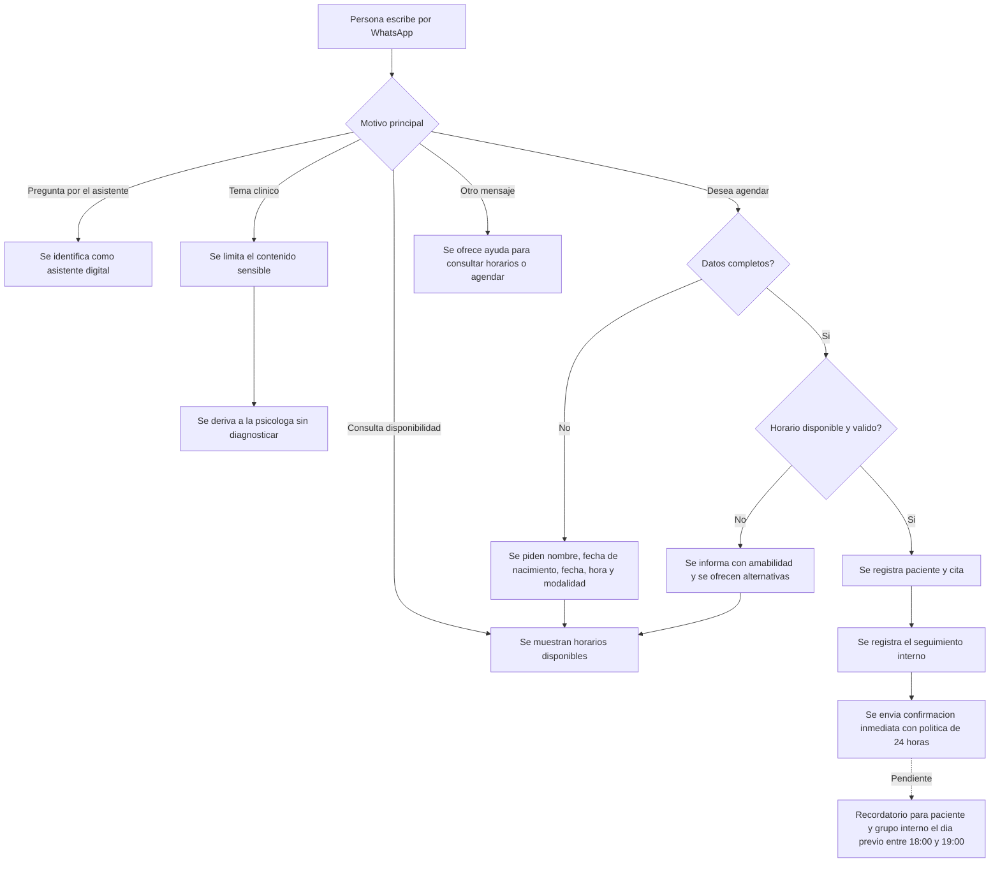

# Segundo Avance - Estado Real del Proyecto

## Contexto de la entrega

El primer avance presentado cubrio la fase de diseno: identidad visual, wireframes, guiones de conversacion y aprobacion de la cliente.

Este segundo avance presenta el trabajo funcional desarrollado despues de esa revision. El alcance implementado se concentro en la base operativa y en el flujo inicial de solicitud de citas por WhatsApp.

El cronograma original ubica el Dia 10 en autenticacion del panel y manejo de pacientes. Esas pantallas aun no estan listas para entrega. Por transparencia, este reporte no las presenta como completadas.

## Avance realizado

### Base operativa

- Se preparo la estructura del proyecto para la aplicacion, el servidor y la base de datos.
- Se definieron reglas para registrar pacientes, citas, mensajes y acciones importantes.
- Se incorporaron reglas de psicóloga asignada, duración y controles para evitar intervalos traslapados en línea o presencial.
- Se realizaron revisiones y pruebas para confirmar que el flujo actual funciona de forma consistente.

### Flujo inicial de citas por WhatsApp

- La persona puede solicitar una cita por WhatsApp.
- El sistema puede mostrar horarios disponibles.
- Para confirmar una cita, solicita nombre y fecha de nacimiento; el numero de WhatsApp se obtiene del mensaje recibido.
- La persona elige si la sesion sera en linea o presencial y si es individual (60 min), de pareja (90 min) o familiar (90 min).
- El sistema registra la cita únicamente con la psicóloga asignada y envía una confirmacion individual con fecha, hora, duración, modalidad y politica de cancelacion.
- Las solicitudes, citas y confirmaciones quedan registradas para seguimiento interno.

### Recordatorios solicitados por la cliente

Los recordatorios forman parte del servicio solicitado y se incluyen en este avance como funcionalidad aprobada para la siguiente etapa:

- Al agendar, la persona ya recibe una confirmacion inmediata.
- El dia previo a la cita, el paciente y el grupo interno de psicólogas deben recibir un recordatorio independiente.
- Esos recordatorios deben enviarse entre las 18:00 y las 19:00, hora de Ciudad de Mexico.
- Si hay saldo, el paciente recibe un aviso privado junto con el recordatorio previo y otro prioritario al concluir la cita.

Los recordatorios programados todavia no estan activos; se mencionan aqui para confirmar que el cambio solicitado despues del primer avance ya forma parte del alcance acordado.

## Mejoras incorporadas despues del primer avance

- El asistente se identifica como digital cuando la persona pregunta si habla con un sistema automatizado.
- El asistente no da diagnosticos, tratamientos ni consejos clinicos.
- Los temas clinicos se derivan a la psicologa con un mensaje de acompanamiento administrativo.
- El contenido clinico sensible se limita para proteger la privacidad.
- Las reservas aceptadas, los horarios no disponibles y las derivaciones clinicas quedan registradas para seguimiento.
- Se reforzaron las pruebas del recorrido completo: solicitud, registro de cita, confirmacion y registro interno.

## Cambio solicitado tras el primer avance: politica de cancelacion

Se incorporo la politica de cancelacion en la confirmacion inmediata de cada cita: la persona recibe el aviso de que debe cancelar o reagendar con al menos 24 horas de anticipacion. Los recordatorios asociados se detallan en la seccion anterior como parte del alcance aprobado pendiente de activacion.

## Flujo de Conversacion de US1

## Validaciones solicitadas a la cliente

Durante esta revision se requiere validar:

- El texto de confirmacion y la politica de cancelacion.
- El tono de los mensajes.
- Los datos que se solicitaran al paciente.
- Las modalidades y la forma de presentar los horarios.
- Los casos que siempre deben pasar directamente a la psicologa.

## Siguiente entrega

La siguiente entrega sera el panel privado para que Jocelyn pueda:

- Consultar su agenda desde el celular.
- Crear citas manualmente.
- Mover citas a otro horario.
- Cancelar citas y notificar al paciente.

Despues se habilitaran el dispatcher de recordatorios para paciente y grupo interno, junto con los avisos de cancelacion y pago pendiente.

## Alcance aun pendiente

- Panel administrativo funcional y acceso privado para Jocelyn.
- Conexion a la cuenta real de WhatsApp del consultorio. Mientras no se configure, los envios se simulan fuera de produccion.
- Pagos, anticipos y comprobantes.
- Recordatorios automáticos aprobados para paciente y grupo interno, avisos de cancelación y avisos de pago pendiente.
- Consultas de pacientes sobre cita o pago.
- Landing publica del consultorio.
- Pruebas de uso con la cliente desde su celular y puesta en produccion.
